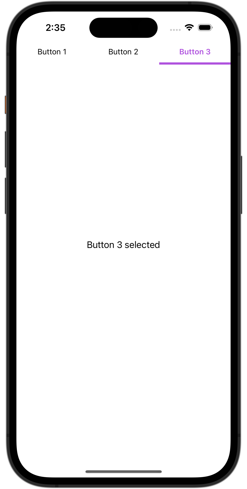
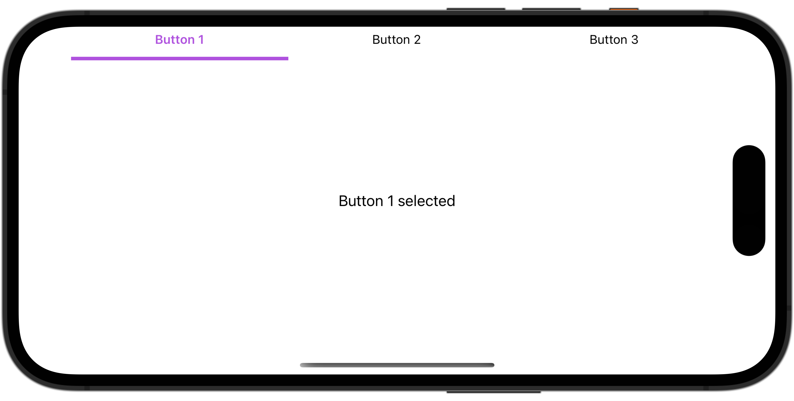

# CustomSegmentedControl
An simple example of a custom segmented control for UIKit.



## Use

Declares the titles for each segment in an array.

```swift
private let buttonTitles: [String] = ["Button 1", "Button 2", "Button 3"]
```

Then create an instance of the custom segmented control passing it the above array as argument:

```swift
private lazy var segmentedControl: CustomSegmetedControl = CustomSegmetedControl(buttonTitles: buttonTitles)
```

Finally, conforms to the delegate protocol to know which button was pressed.

```swift
extension ViewController: CustomSegmetedControlDelegate {
    func buttonPressed(buttonTitlesIndex: Int, title: String?) {
				// some action
    }
}
```

## Video
